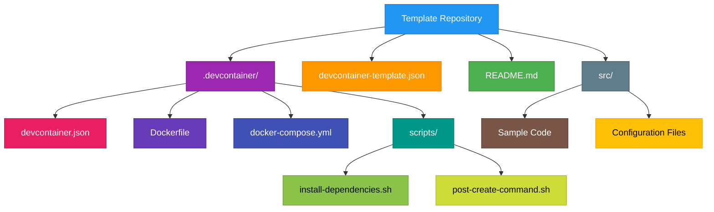
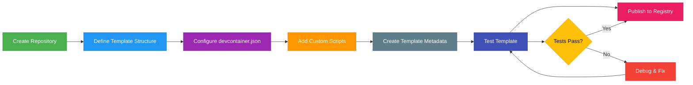
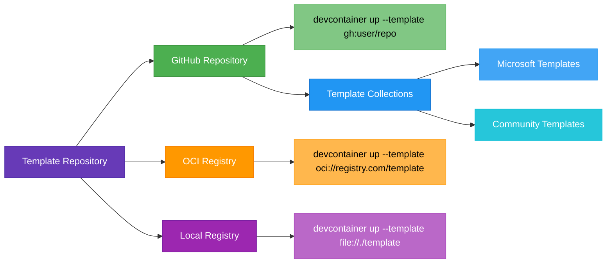

# Creating Devcontainer Templates

## Overview

Devcontainer templates provide reusable, standardized development environments that can be shared across teams and projects. This guide covers how to create, structure, and distribute devcontainer templates using the devcontainer CLI.

## Template Repository Structure



## Key Components

### 1. devcontainer-template.json
This metadata file defines your template properties:

```json
{
    "id": "dotnet-fsharp-template",
    "version": "1.0.0",
    "name": ".NET F# Development Template",
    "description": "A template for .NET and F# development with tooling",
    "documentationURL": "https://github.com/username/dotnet-fsharp-template",
    "licenseURL": "https://github.com/username/dotnet-fsharp-template/blob/main/LICENSE",
    "options": {
        "dotnetVersion": {
            "type": "string",
            "description": ".NET version",
            "proposals": ["6.0", "7.0", "8.0"],
            "default": "8.0"
        },
        "includeAspNetCore": {
            "type": "boolean",
            "description": "Include ASP.NET Core templates",
            "default": true
        },
        "includeFantomas": {
            "type": "boolean",
            "description": "Include Fantomas F# formatter",
            "default": true
        }
    }
}
```

### 2. .devcontainer/devcontainer.json
The core configuration file:

```json
{
    "name": ".NET F# Template",
    "build": {
        "dockerfile": "Dockerfile",
        "args": {
            "DOTNET_VERSION": "${templateOption:dotnetVersion}",
            "INCLUDE_ASPNET": "${templateOption:includeAspNetCore}",
            "INCLUDE_FANTOMAS": "${templateOption:includeFantomas}"
        }
    },
    "features": {
        "ghcr.io/devcontainers/features/common-utils:2": {},
        "ghcr.io/devcontainers/features/git:1": {},
        "ghcr.io/devcontainers/features/dotnet:2": {
            "version": "${templateOption:dotnetVersion}",
            "installUsingApt": false
        }
    },
    "customizations": {
        "vscode": {
            "extensions": [
                "ms-dotnettools.csharp",
                "ionide.ionide-fsharp",
                "ms-dotnettools.vscode-dotnet-runtime",
                "formulahendry.dotnet-test-explorer"
            ],
            "settings": {
                "FSharp.enableTreeView": true,
                "FSharp.showExplorerOnStartup": true,
                "dotnet.completion.showCompletionItemsFromUnimportedNamespaces": true
            }
        }
    },
    "postCreateCommand": "bash .devcontainer/scripts/post-create.sh",
    "remoteUser": "vscode"
}
```

## Template Creation Workflow



## Step-by-Step Creation Process

### Step 1: Initialize Template Repository

```bash
mkdir dotnet-fsharp-template
cd dotnet-fsharp-template
git init
```

### Step 2: Create Directory Structure

```bash
mkdir -p .devcontainer/scripts
mkdir -p src
touch devcontainer-template.json
touch .devcontainer/devcontainer.json
touch .devcontainer/Dockerfile
touch README.md
```

### Step 3: Configure Dockerfile

```dockerfile
ARG DOTNET_VERSION=8.0
ARG INCLUDE_ASPNET=true
ARG INCLUDE_FANTOMAS=true

FROM mcr.microsoft.com/dotnet/sdk:${DOTNET_VERSION} AS base

# Install additional packages
RUN apt-get update && apt-get install -y \
    git \
    curl \
    wget \
    vim \
    nano \
    unzip \
    build-essential \
    && rm -rf /var/lib/apt/lists/*

# Install global .NET tools
RUN dotnet tool install -g dotnet-ef
RUN dotnet tool install -g dotnet-outdated-tool
RUN dotnet tool install -g dotnet-reportgenerator-globaltool

# Install Fantomas if requested
RUN if [ "$INCLUDE_FANTOMAS" = "true" ]; then \
        dotnet tool install -g fantomas; \
    fi

# Install Paket for F# package management
RUN dotnet tool install -g paket

# Add .NET tools to PATH
ENV PATH="${PATH}:/root/.dotnet/tools"

# Create non-root user
RUN groupadd --gid 1000 vscode \
    && useradd --uid 1000 --gid vscode --shell /bin/bash --create-home vscode \
    && mkdir -p /home/vscode/.dotnet/tools \
    && chown -R vscode:vscode /home/vscode

USER vscode

# Install user-level tools
RUN dotnet tool install --global dotnet-ef
RUN dotnet tool install --global fantomas
RUN dotnet tool install --global paket

# Add user tools to PATH
ENV PATH="${PATH}:/home/vscode/.dotnet/tools"
```

### Step 4: Add Post-Create Scripts

`.devcontainer/scripts/post-create.sh`:
```bash
#!/bin/bash

echo "🚀 Setting up .NET F# development environment..."

# Restore .NET packages if solution/project files exist
if find . -name "*.sln" -o -name "*.csproj" -o -name "*.fsproj" | grep -q .; then
    echo "📦 Restoring .NET packages..."
    dotnet restore
fi

# Install Paket dependencies if paket.dependencies exists
if [ -f "paket.dependencies" ]; then
    echo "� Installing Paket dependencies..."
    paket install
fi

# Set up git hooks if .githooks directory exists
if [ -d ".githooks" ]; then
    echo "🪝 Setting up git hooks..."
    git config core.hooksPath .githooks
fi

# Create sample F# project if no projects exist
if ! find . -name "*.fsproj" | grep -q .; then
    echo "🆕 Creating sample F# console application..."
    dotnet new console -lang F# -o SampleApp
    cd SampleApp
    echo 'printfn "Hello from F#!"' > Program.fs
    cd ..
fi

# Install recommended F# project templates
echo "📋 Installing F# project templates..."
dotnet new install "Microsoft.AspNetCore.SPA.ProjectTemplates"
dotnet new install "Giraffe.Template"

echo "✅ .NET F# development environment ready!"
echo "💡 Available commands:"
echo "   - dotnet new list (see available project templates)"
echo "   - dotnet build (build solution)"
echo "   - dotnet test (run tests)"
echo "   - fantomas --recurse . (format F# code)"
echo "   - paket install (install packages via Paket)"
```

## Distribution Methods



## Publishing Templates

### Option 1: GitHub Repository
1. Push template to GitHub
2. Tag releases for versioning
3. Users can reference: `gh:username/template-name`
4. Apply with: `devcontainer templates apply --template-id gh:username/template-name`

### Option 2: Template Collections
Contribute to official template collections:
- [devcontainers/templates](https://github.com/devcontainers/templates)
- Create PR with your template

### Option 3: OCI Registry
```bash
# Build and push to container registry
devcontainer templates publish ./dotnet-fsharp-template oci://myregistry.com/templates/dotnet-fsharp:latest
```

## Integration with VS Code and Codespaces

### VS Code Dev Containers Extension
- Automatically detects `.devcontainer` files in repositories
- Can clone repositories directly into containers
- Command palette: "Dev Containers: Clone Repository in Container Volume"

### GitHub Codespaces
- Automatically builds devcontainer when `.devcontainer` folder exists
- No need for manual CLI commands
- Opens directly in browser or VS Code

### Azure Developer CLI (azd) vs Devcontainer CLI
**Important Distinction:**
- **Azure Developer CLI (azd)**: Different tool for Azure deployments
  - Uses `azd init --template` syntax
  - Focuses on Azure infrastructure and deployment
- **Devcontainer CLI**: Focuses on development environments
  - Uses `devcontainer templates apply --template-id` syntax
  - Creates development containers

## Using Templates with CLI

### Correct GitHub Template Workflow

**Important:** The devcontainer CLI requires a two-step process when using GitHub templates:

1. **Apply template first** (creates `.devcontainer` configuration files):
```bash
# Apply template from GitHub repository
devcontainer templates apply --template-id gh:username/dotnet-fsharp-template

# Apply with specific options
devcontainer templates apply \
  --template-id gh:username/dotnet-fsharp-template \
  --template-args '{"dotnetVersion":"8.0","includeAspNetCore":true,"includeFantomas":true}'

# Apply from local template
devcontainer templates apply --template-id file://./dotnet-fsharp-template
```

2. **Then start the container**:
```bash
# After template is applied, start the devcontainer
devcontainer up
```

### GitHub Template ID Formats

The devcontainer CLI supports these GitHub reference formats:

- **`gh:owner/repo`** - Uses template from the main branch
- **`gh:owner/repo@tag`** - Uses a specific tag/release
- **`gh:owner/repo@branch`** - Uses a specific branch
- **`gh:owner/repo/path`** - Uses template from a subdirectory

### Complete Example Workflow

```bash
# 1. Create new project directory
mkdir my-fsharp-project
cd my-fsharp-project

# 2. Apply template from GitHub
devcontainer templates apply --template-id gh:username/dotnet-fsharp-template

# 3. Start the devcontainer
devcontainer up

# 4. Connect to the running container
devcontainer exec bash
```

### Other CLI Commands

```bash
# List available templates (may not show GitHub templates)
devcontainer templates list

# Get template metadata
devcontainer templates metadata gh:username/dotnet-fsharp-template

# Validate template structure
devcontainer templates validate ./dotnet-fsharp-template

# Publish template to registry
devcontainer templates publish ./dotnet-fsharp-template oci://registry.com/templates/dotnet-fsharp:latest
```

## Best Practices

### Template Design
- **Keep it focused**: One template per tech stack
- **Make it configurable**: Use template options for variations
- **Include documentation**: Clear README with usage examples
- **Test thoroughly**: Test on different platforms

### Performance Optimization
- **Use multi-stage builds**: Reduce image size
- **Cache dependencies**: Leverage Docker layer caching
- **Pre-install common tools**: Include frequently used packages

### Security Considerations
- **Use official base images**: Start from trusted sources
- **Pin versions**: Avoid `latest` tags in production
- **Scan for vulnerabilities**: Regular security audits
- **Minimal privileges**: Run as non-root user when possible

## Template Validation

```bash
# Validate template structure before publishing
devcontainer templates validate ./dotnet-fsharp-template

# Test template application in clean directory
mkdir test-project && cd test-project
devcontainer templates apply --template-id file://../dotnet-fsharp-template

# Test container startup
devcontainer up

# Cleanup test environment
cd .. && rm -rf test-project
```

## Alternative Usage Methods

### Method 1: VS Code Extension (Recommended for GUI users)
1. Install "Dev Containers" extension in VS Code
2. Open Command Palette (Ctrl+Shift+P)
3. Select "Dev Containers: Add Dev Container Configuration Files..."
4. Choose from available templates or specify GitHub repository

### Method 2: GitHub Codespaces (Cloud-based)
1. Create repository with `.devcontainer` folder
2. Click "Code" → "Create codespace on main"
3. Automatically builds and opens in browser/VS Code

### Method 3: Direct CLI (For automation/scripts)
1. Use `devcontainer templates apply` to generate configuration
2. Use `devcontainer up` to start container
3. Use `devcontainer exec` to run commands in container

## Advanced Features

### Custom Features
Create reusable features for your templates:

```json
{
    "features": {
        "./features/my-custom-feature": {
            "version": "latest",
            "options": {
                "enableFeature": true
            }
        }
    }
}
```

### Template Inheritance
Chain templates for complex setups:

```json
{
    "build": {
        "dockerfile": "Dockerfile",
        "context": "."
    },
    "overrideFeatureInstallOrder": [
        "ghcr.io/devcontainers/features/common-utils",
        "./features/base-setup",
        "./features/project-specific"
    ]
}
```

## Maintenance & Updates

- **Version your templates**: Use semantic versioning
- **Keep dependencies updated**: Regular dependency updates
- **Monitor usage**: Track template adoption
- **Gather feedback**: Improve based on user experience
- **Document changes**: Maintain changelog

## Resources

- [Devcontainer Templates Specification](https://containers.dev/implementors/templates/)
- [Template Examples](https://github.com/devcontainers/templates)
- [Devcontainer CLI Documentation](https://containers.dev/supporting#devcontainer-cli)
- [Feature Development](https://containers.dev/implementors/features/)
- [VS Code Dev Containers Extension](https://marketplace.visualstudio.com/items?itemName=ms-vscode-remote.remote-containers)
- [GitHub Codespaces Documentation](https://docs.github.com/en/codespaces)

## Important Notes

### CLI vs Extension Differences
- **Devcontainer CLI**: Command-line tool requiring manual template application
- **VS Code Extension**: GUI-based with automatic template detection
- **GitHub Codespaces**: Cloud-based with automatic container building

### Template Types
- **Development Container Templates**: For dev environments (this guide)
- **Azure Developer CLI Templates**: For Azure deployment (different tool)

### Best Practices for GitHub Templates
1. **Use semantic versioning** with Git tags
2. **Provide clear README** with usage instructions  
3. **Test across platforms** (Windows, macOS, Linux)
4. **Document template options** in `devcontainer-template.json`
5. **Include example projects** in `src/` folder