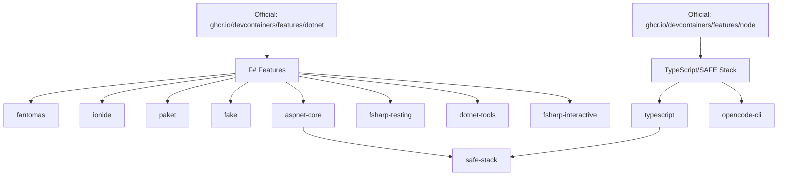

# .NET SDK Dependency Strategy for F# Devcontainer Features

## Strategic Decision: Use Official Devcontainer Features vs Custom Implementation

### ✅ **RECOMMENDED APPROACH: Use Official Features**

Our F# devcontainer features **DO NOT** implement .NET SDK as separate features (#8, #9, #10). Instead, we leverage the **official devcontainer features ecosystem**.

### Dependency Chain



## Implementation Pattern

### In devcontainer-feature.json
```json
{
  "installsAfter": [
    "ghcr.io/devcontainers/features/dotnet"
  ]
}
```

### In install.sh validation
```bash
validate_environment() {
    if ! command -v dotnet >/dev/null 2>&1; then
        echo "❌ .NET SDK not found. Please ensure the dotnet feature is installed first."
        exit 1
    fi
    echo "✅ .NET SDK found: $(dotnet --version)"
}
```

## Why This Approach?

### ✅ **Advantages**
1. **Maintenance**: Official features are maintained by Microsoft/community
2. **Reliability**: Battle-tested across thousands of projects
3. **Compatibility**: Guaranteed compatibility with devcontainer spec
4. **Updates**: Automatic security and version updates
5. **Standards**: Follows devcontainer best practices
6. **Flexibility**: Users can choose specific .NET versions independently

### ❌ **Avoided Complexity**
- No need to maintain .NET installation logic
- No version compatibility matrix management
- No security patching responsibilities
- No cross-platform installation handling
- No SDK vs Runtime distinction management

## Official Features We Depend On

### 1. .NET SDK Feature
```json
{
  "features": {
    "ghcr.io/devcontainers/features/dotnet:2": {
      "version": "8.0",
      "dotnetRuntimeVersions": "6.0,7.0,8.0",
      "aspNetCoreRuntimeVersions": "6.0,7.0,8.0"
    }
  }
}
```

**Used by**: fantomas, ionide, paket, fake, aspnet-core, fsharp-testing, dotnet-tools, fsharp-interactive

### 2. Node.js Feature  
```json
{
  "features": {
    "ghcr.io/devcontainers/features/node:1": {
      "nodeGypDependencies": true,
      "version": "18"
    }
  }
}
```

**Used by**: typescript, opencode-cli, safe-stack

### 3. Common Utilities Feature
```json
{
  "features": {
    "ghcr.io/devcontainers/features/common-utils:2": {
      "installZsh": true,
      "configureZshAsDefaultShell": true,
      "installOhMyZsh": true
    }
  }
}
```

**Used by**: All features (optional, for better UX)

## Feature Numbering Clarification

Our **11 custom F# features** are:

1. **fantomas** - F# code formatter
2. **ionide** - F# language support for VS Code  
3. **paket** - Package manager with FSI integration
4. **fake** - F# build system
5. **aspnet-core** - Web development frameworks
6. **safe-stack** - Full-stack F# development
7. **typescript** - TypeScript integration for Fable
8. **opencode-cli** - AI assistant integration
9. **fsharp-testing** - Testing framework setup
10. **dotnet-tools** - Common .NET tools
11. **fsharp-interactive** - Enhanced REPL and notebooks

### NOT Implemented as Custom Features
- ❌ **.NET SDK** - Use `ghcr.io/devcontainers/features/dotnet`
- ❌ **Node.js** - Use `ghcr.io/devcontainers/features/node`  
- ❌ **Git** - Use `ghcr.io/devcontainers/features/git`
- ❌ **VS Code** - Built into devcontainer environment

## Template Usage Example

```json
{
  "name": "F# Development Environment",
  "image": "mcr.microsoft.com/devcontainers/base:ubuntu",
  "features": {
    "ghcr.io/devcontainers/features/dotnet:2": {
      "version": "8.0"
    },
    "ghcr.io/devcontainers/features/node:1": {
      "version": "18"
    },
    "./features/src/fantomas": {
      "version": "latest",
      "enableEditorConfig": true
    },
    "./features/src/ionide": {
      "enableFSAC": true,
      "enablePaketIntegration": true
    },
    "./features/src/paket": {
      "enableFSIIntegration": true,
      "generateLoadScripts": true
    },
    "./features/src/typescript": {
      "configTemplate": "fable",
      "includeFableTypes": true
    },
    "./features/src/aspnet-core": {
      "framework": "giraffe",
      "includeSwagger": true
    }
  }
}
```

## Testing Strategy

### Dependency Validation
```bash
# Test that features work with official dependencies
devcontainer features test \
  --features '{"ghcr.io/devcontainers/features/dotnet": {"version": "8.0"}, "./features/src/fantomas": {}}' \
  ./test-workspace
```

### Version Compatibility Matrix
| .NET Version | F# Features | TypeScript | ASP.NET Core |
|--------------|-------------|------------|--------------|
| 6.0 | ✅ All | ✅ | ✅ |
| 7.0 | ✅ All | ✅ | ✅ |  
| 8.0 | ✅ All | ✅ | ✅ |

## Security Benefits

### Official Feature Security
- **Automatic Updates**: Microsoft maintains security patches
- **Signed Packages**: Official features are cryptographically signed
- **CVE Monitoring**: Official features monitor for vulnerabilities
- **Audit Trail**: Official features have public audit trails

### Our Feature Security
- **Minimal Surface**: Only install F#-specific tools
- **Validation**: All features validate official dependencies first
- **No Elevation**: No unnecessary privilege escalation
- **Transparency**: All installation steps are logged

## Future Roadmap

### When Official Features Are Insufficient
If we need functionality not provided by official features, we can:

1. **Contribute Back**: Submit PRs to official features
2. **Extend Features**: Create compatible extensions
3. **Custom Implementation**: Last resort for unique requirements

### Version Management
- **Automated Testing**: CI validates against latest official feature versions
- **Compatibility Tracking**: Maintain compatibility matrix
- **Migration Guides**: Provide upgrade paths when official features change

## Conclusion

**✅ Our approach of using official devcontainer features for base dependencies (like .NET SDK) while implementing F#-specific features is the correct architectural decision.**

This provides:
- **Reliability** through official maintenance
- **Flexibility** for F# developers  
- **Maintainability** for our feature set
- **Community Support** through established patterns

The **11 F# features** we implement focus purely on F# ecosystem tools, letting the official features handle the foundational infrastructure.