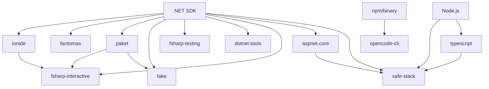

# F# Devcontainer Features: Requirements & Incompatibilities

## Feature Dependency Graph

### Core Dependencies


## System Requirements

### Base System Dependencies

#### Required for All Features
- **Operating System**: Linux (Ubuntu 20.04+, Debian 11+)
- **Architecture**: x86_64, arm64
- **Base Container**: `mcr.microsoft.com/dotnet/sdk:8.0` or compatible
- **User Context**: Non-root user with sudo access
- **Disk Space**: Minimum 2GB available

#### .NET SDK Requirements
```json
{
  "dotnet": {
    "minimumVersion": "6.0",
    "recommendedVersion": "8.0",
    "compatibleVersions": ["6.0", "7.0", "8.0"],
    "requiredFor": ["ALL_FEATURES"]
  }
}
```

### Feature-Specific Requirements

## 1. ionide (F# Language Support)

### Hard Requirements
- **Base**: .NET SDK 6.0+
- **VS Code**: Must be available in container
- **Extensions API**: VS Code extensions must be installable

### Optional Dependencies
- **Git**: For source control integration
- **FSI**: Enhanced when combined with fsharp-interactive

### Resource Requirements
- **Memory**: 512MB minimum, 1GB recommended
- **CPU**: Any modern x86_64/arm64
- **Network**: Required for extension marketplace access

### Configuration Dependencies
```json
{
  "vscode": {
    "extensions": ["ms-dotnettools.csharp"],
    "settings": {
      "fsharp.enableLSP": true
    }
  }
}
```

## 2. fantomas (F# Code Formatter)

### Hard Requirements
- **Base**: .NET SDK 6.0+
- **Global Tools**: `dotnet tool install` capability

### Soft Dependencies
- **EditorConfig**: Enhanced formatting when .editorconfig present
- **VS Code**: Format-on-save requires VS Code integration

### Version Compatibility
```json
{
  "fantomas": {
    "versions": {
      "7.0.3": "stable",
      "6.3.9": "legacy",
      "5.2.4": "deprecated"
    },
    "dotnetCompatibility": {
      "8.0": "all_versions",
      "7.0": "7.0.3+",
      "6.0": "6.3.9+"
    }
  }
}
```

### Known Issues
- **Performance**: Large files (>10k lines) may timeout
- **Memory**: Requires 256MB+ for complex projects

## 3. paket (Dependency Manager)

### Hard Requirements
- **Base**: .NET SDK 6.0+
- **File System**: Write access to project directory
- **Network**: Package source access

### Compatibility Conflicts
```json
{
  "conflicts": {
    "nuget_central_management": "warning",
    "packageReference_projects": "configurable"
  }
}
```

### Integration Dependencies
- **fake**: Enhanced build integration
- **fsharp-interactive**: Required for FSI package loading

### Project Structure Requirements
```
project/
├── paket.dependencies    # Created by paket
├── paket.lock           # Generated lock file
└── src/
    └── Project/
        └── paket.references  # Package references
```

## 4. fake (F# Build System)

### Hard Requirements
- **Base**: .NET SDK 6.0+
- **PowerShell**: Core 7.0+ (auto-installed)

### Soft Dependencies
- **paket**: Enhanced package management
- **Git**: Source control operations
- **Docker**: Container build targets

### Build Script Dependencies
```fsharp
// build.fsx requirements
#r "paket:
nuget Fake.DotNet.Cli
nuget Fake.Core.Target //"
```

### Resource Requirements
- **Memory**: 512MB minimum (build processes)
- **Disk**: 500MB for build artifacts
- **CPU**: Multi-core recommended for parallel builds

## 5. aspnet-core (ASP.NET Core for F#)

### Hard Requirements
- **Base**: .NET SDK 6.0+ with ASP.NET Core runtime
- **Templates**: ASP.NET Core project templates
- **Network**: HTTP/HTTPS port access

### Framework-Specific Requirements

#### Giraffe Framework
```json
{
  "giraffe": {
    "minimumDotNet": "6.0",
    "packages": ["Giraffe", "Microsoft.AspNetCore.App"],
    "conflictsWith": ["saturn_routing"]
  }
}
```

#### Saturn Framework
```json
{
  "saturn": {
    "minimumDotNet": "6.0",
    "packages": ["Saturn", "Giraffe"],
    "requires": ["Giraffe"],
    "conflictsWith": ["minimal_apis"]
  }
}
```

### Port Requirements
- **Development**: 5000 (HTTP), 5001 (HTTPS)
- **Swagger**: 5000/swagger (if enabled)
- **Hot Reload**: WebSocket connection required

## 6. safe-stack (SAFE Stack Full-Stack F#)

### Hard Requirements
- **Base**: .NET SDK 8.0+ (SAFE Template requirement)
- **Node.js**: 18.0+ LTS
- **npm**: 9.0+ or yarn/pnpm
- **Git**: For template scaffolding

### Complex Dependency Chain
```json
{
  "safe_stack": {
    "dotnet_requirements": {
      "sdk": "8.0+",
      "templates": ["SAFE.Template"],
      "tools": ["fable"]
    },
    "nodejs_requirements": {
      "version": "18.0+",
      "global_packages": ["webpack", "webpack-cli"],
      "package_manager": "npm|yarn|pnpm"
    },
    "integration_requirements": {
      "saturn": "server_framework",
      "fable": "client_compiler",
      "elmish": "ui_framework"
    }
  }
}
```

### Resource Requirements (High)
- **Memory**: 2GB minimum, 4GB recommended
- **Disk**: 1.5GB for toolchain + node_modules
- **Network**: NPM registry + NuGet feeds
- **Build Time**: 5-10 minutes initial setup

### Database Requirements (Optional)
```json
{
  "database_providers": {
    "litedb": {"requirements": [], "conflicts": []},
    "postgres": {"requires": ["postgresql-client"], "ports": [5432]},
    "sqlserver": {"requires": ["mssql-tools"], "ports": [1433]}
  }
}
```

## 7. opencode-cli (AI Code Assistant)

### Hard Requirements
- **Installation Path**: Node.js OR standalone binary
- **Network**: API access to opencode.ai
- **Authentication**: API key or OAuth

### Installation Options
```json
{
  "installation_methods": {
    "npm": {
      "requires": ["nodejs:16+", "npm"],
      "command": "npm install -g @opencode/cli"
    },
    "binary": {
      "requires": ["curl", "unzip"],
      "platforms": ["linux-x64", "linux-arm64"]
    }
  }
}
```

### VS Code Integration
- **Extension**: opencode.opencode-vscode
- **Settings**: API key configuration
- **Conflicts**: Other AI coding assistants (configurable)

## 8. fsharp-testing (Testing Framework Setup)

### Hard Requirements
- **Base**: .NET SDK 6.0+
- **Test Framework**: One of xUnit, NUnit, MSTest

### Framework Compatibility Matrix
```json
{
  "test_frameworks": {
    "xunit": {
      "dotnet_versions": ["6.0", "7.0", "8.0"],
      "fsharp_support": "native",
      "packages": ["xunit", "xunit.runner.visualstudio"]
    },
    "nunit": {
      "dotnet_versions": ["6.0", "7.0", "8.0"],
      "fsharp_support": "good",
      "packages": ["NUnit", "NUnit3TestAdapter"]
    },
    "mstest": {
      "dotnet_versions": ["6.0", "7.0", "8.0"],
      "fsharp_support": "basic",
      "packages": ["MSTest.TestFramework", "MSTest.TestAdapter"]
    }
  }
}
```

### Coverage Tools
- **Coverlet**: Default coverage tool
- **ReportGenerator**: HTML report generation
- **Integration**: VS Code Test Explorer

## 9. dotnet-tools (Common .NET Tools)

### Hard Requirements
- **Base**: .NET SDK 6.0+
- **Global Tools**: Capability to install global tools

### Tool Categories
```json
{
  "tool_categories": {
    "entity_framework": {
      "tools": ["dotnet-ef"],
      "requires": ["Microsoft.EntityFrameworkCore.Design"]
    },
    "package_management": {
      "tools": ["dotnet-outdated"],
      "conflicts_with": ["paket_outdated"]
    },
    "templates": {
      "tools": ["dotnet-new3"],
      "enhances": ["aspnet-core", "safe-stack"]
    }
  }
}
```

## 10. fsharp-interactive (F# REPL & Notebooks)

### Hard Requirements
- **Base**: .NET SDK 6.0+
- **Interactive Tools**: Microsoft.dotnet-interactive
- **Dependencies**: ionide (for VS Code integration)

### Enhanced Dependencies
```json
{
  "fsharp_interactive": {
    "core_requirements": {
      "dotnet_interactive": "1.0.0+",
      "fsi": "bundled_with_sdk"
    },
    "enhanced_with": {
      "paket": "fsi_package_loading",
      "ionide": "vscode_integration",
      "jupyter": "notebook_support"
    }
  }
}
```

### Kernel Requirements
- **Jupyter**: Optional for notebook support
- **VS Code**: .NET Interactive extension
- **PowerShell**: For multi-language notebooks

## 11. typescript (TypeScript Development Support)

### Hard Requirements
- **Base**: Node.js 16+ LTS
- **Package Manager**: npm, yarn, or pnpm
- **Global Tools**: TypeScript compiler installation capability

### Integration Requirements
```json
{
  "typescript": {
    "core_requirements": {
      "nodejs": "16.0+",
      "typescript": "4.5+",
      "package_manager": "npm|yarn|pnpm"
    },
    "fable_integration": {
      "fable_types": "@fable-org/fable-library",
      "compiler_output": "compatible_with_typescript",
      "debugging": "source_map_support"
    },
    "vscode_integration": {
      "extensions": ["ms-vscode.vscode-typescript-next"],
      "settings": {"typescript.preferences.includePackageJsonAutoImports": "on"}
    }
  }
}
```

### Configuration Templates
```json
{
  "config_templates": {
    "fable": {
      "compilerOptions": {
        "target": "ES2020",
        "module": "ES2020",
        "moduleResolution": "node",
        "allowJs": true,
        "skipLibCheck": true
      }
    },
    "standard": {
      "compilerOptions": {
        "target": "ES2020",
        "module": "commonjs",
        "strict": true,
        "esModuleInterop": true
      }
    }
  }
}
```

### Resource Requirements
- **Memory**: 512MB for TypeScript language service
- **Disk**: 400MB for TypeScript + Node.js toolchain
- **CPU**: Any modern x86_64/arm64
- **Network**: NPM registry access for @types packages

### Integration Dependencies
- **SAFE Stack**: Enhanced client-side development
- **Fable**: F# to TypeScript compilation support
- **VS Code**: TypeScript language service integration

## Feature Incompatibilities Matrix

### Hard Incompatibilities (Cannot Coexist)

#### Package Management Conflicts
```json
{
  "package_management": {
    "paket_vs_nuget": "soft_conflict",
    "resolution": "user_choice_required",
    "impact": "project_structure_differences"
  }
}
```

#### Web Framework Conflicts
```json
{
  "web_frameworks": {
    "aspnet_core_minimal_vs_saturn": "hard_conflict",
    "resolution": "mutually_exclusive_options",
    "workaround": "separate_projects"
  }
}
```

### Soft Incompatibilities (Performance/Configuration Issues)

#### Resource Competition
```json
{
  "resource_conflicts": {
    "safe_stack_memory": {
      "conflict_with": ["heavy_dotnet_tools"],
      "threshold": "2GB_total_memory",
      "mitigation": "sequential_installation"
    }
  }
}
```

#### Port Conflicts
```json
{
  "port_conflicts": {
    "aspnet_core_vs_safe_stack": {
      "default_ports": [5000, 5001],
      "resolution": "configurable_ports",
      "auto_detect": true
    }
  }
}
```

## Installation Order Dependencies

### Critical Installation Sequence
```yaml
installation_order:
  phase_1_foundation:
    - dotnet_sdk  # Must be first
    - nodejs      # Required for TypeScript and SAFE Stack
    - base_tools  # curl, git, etc.
  
  phase_2_core_tools:
    - fantomas    # Independent
    - paket       # Independent
    - dotnet_tools # Independent
    - typescript  # Requires Node.js
  
  phase_3_ide_integration:
    - ionide      # Requires dotnet_sdk
  
  phase_4_enhanced_features:
    - fsharp_interactive  # Requires ionide, paket (optional)
    - fsharp_testing     # Requires dotnet_sdk
    - fake              # Requires paket (optional)
  
  phase_5_web_development:
    - aspnet_core       # Requires dotnet_sdk
    - safe_stack        # Requires aspnet_core, nodejs, typescript (optional)
  
  phase_6_optional:
    - opencode_cli      # Independent
```

### Dependency Resolution Rules
```json
{
  "resolution_strategy": {
    "missing_dependencies": "auto_install_with_warning",
    "version_conflicts": "use_latest_compatible",
    "hard_conflicts": "fail_with_error_message",
    "soft_conflicts": "warn_and_continue"
  }
}
```

## Validation & Testing Requirements

### Pre-Installation Validation
```bash
# System requirements check
validate_system() {
    check_dotnet_version
    check_available_memory
    check_disk_space
    check_network_connectivity
    validate_user_permissions
}

# Feature compatibility check
validate_feature_combination() {
    check_mutual_exclusions
    validate_dependency_chain
    estimate_resource_requirements
    warn_about_conflicts
}
```

### Post-Installation Verification
```bash
# Feature verification
verify_installation() {
    test_tool_availability
    validate_vscode_integration
    check_sample_project_builds
    verify_feature_interactions
}
```

## Configuration Management

### Environment Variables
```bash
# Feature configuration
export FANTOMAS_VERSION="7.0.3"
export PAKET_AUTO_RESTORE="true"
export SAFE_TEMPLATE="minimal"
export ASPNET_FRAMEWORK="giraffe"
export TYPESCRIPT_VERSION="5.0"
export TYPESCRIPT_CONFIG_TEMPLATE="fable"
export OPENCODE_API_KEY="<configured_separately>"
```

### Feature Interaction Configuration
```json
{
  "feature_interactions": {
    "paket_with_fsi": {
      "enable_load_scripts": true,
      "auto_generate_references": true
    },
    "ionide_with_fantomas": {
      "format_on_save": true,
      "use_editorconfig": true
    },
    "fake_with_paket": {
      "use_paket_restore": true,
      "generate_paket_targets": true
    },
    "typescript_with_fable": {
      "enable_source_maps": true,
      "fable_type_generation": true,
      "typescript_output_compatibility": true
    },
    "safe_stack_with_typescript": {
      "client_typescript_integration": true,
      "shared_type_definitions": true,
      "hot_reload_coordination": true
    }
  }
}
```

## Error Handling & Recovery

### Common Failure Scenarios
```json
{
  "failure_scenarios": {
    "network_timeout": {
      "retry_strategy": "exponential_backoff",
      "max_retries": 3,
      "fallback": "offline_packages"
    },
    "version_incompatibility": {
      "strategy": "downgrade_to_compatible",
      "user_notification": "required"
    },
    "resource_exhaustion": {
      "strategy": "sequential_installation",
      "cleanup": "temporary_files"
    }
  }
}
```

This requirements document ensures robust feature development with clear dependency management and conflict resolution strategies.